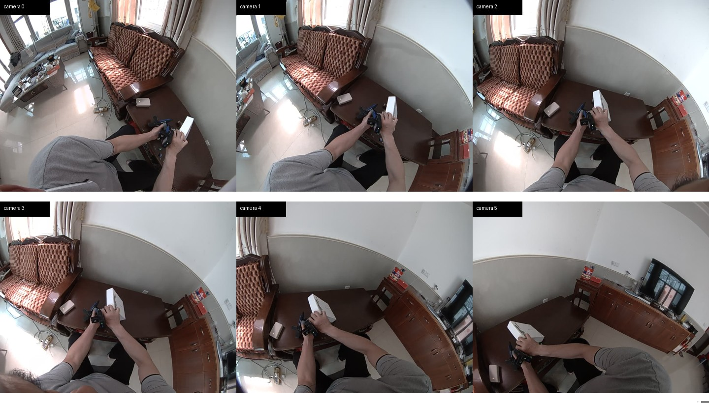

# GenRobot DAS Egoの採用判定

調査日: 2026-09-10。公開一次資料、公式GitHubの原本MCAP、現行販売表示を確認した。メーカーへの照会・注文はまだ行っていない。

> **2026-09-11の価格反映:** DAS Egoは性能比較の基準として残すが、量産購入候補からは外した。現在の完成機候補はEGO1GS、最低価格の基準機はRaspberry Pi 5分離型である。現行判断は[低価格経路の採用判断](LOW-COST-DECISION-2026-09-11.md)を参照する。

## 判定

**2026-09-10時点ではDAS Egoを条件付き第一評価候補と判定した。** OSCAR相当候補となるカラーGS二眼と200 Hzの6軸計測を含み、六眼、音声、VIO、保存、演算、電池、頭部保持まで一体になっている。公開サンプルは単なる仕様表ではなく、実際に六眼H.264、加速度・角速度、時刻、番号、個体カメラ校正を含む。ただし物理露光同期は未証明で、公式マニュアルはIMU出力を「校正・アルゴリズム処理後」としており、センサーの未処理生値かも未確認である。2026-09-11の価格反映後は購入候補ではない。

一方、現在の公開状態では発注できない。無停止5時間、現行販売SKUと日本納入、データ販売権、国内無線適合の四点を直販契約で通してから評価1台を買う。

下図は[公式GitHubの原本MCAP](https://github.com/genrobot-ai/das-ego-stack/tree/main/sample_input)から、同時刻付近の六映像を取り出して並べたもの。camera2/3が前方下向きの中央ステレオ組で、外側四眼が左右と身体側を補う。

## 必須条件との照合

| RootLens要件 | 現在の判定 | 根拠と残件 |
|---|---|---|
| カラーGS二眼、30 fps以上 | 合格 | 六眼すべてRGB GS 1600×1300・30 Hz。中央camera2/3に前方重複視野 |
| 左右の元映像 | 合格 | 各カメラの元H.264を独立MCAP topicに保存 |
| 生の加速度・角速度 | 未確定 | 200 Hz、欠番なし。ただし2×2 IMU arrayを処理した1系統で、未処理生値か、単位・軸・符号・フィルタが未定義 |
| フレーム番号・測定時刻 | 条件付き合格 | `sequence_num`とns `header.timestamp`あり。timestampの物理的な測定点が未定義 |
| stereo/camera–IMU校正 | 条件付き合格 | 六眼のDouble Sphere内部・歪み・個体別`T_b_c`あり。公称URDFは各カメラを`imu_link`へ接続するが、MCAPのbaseとの同一性、軸規約、校正残差が未提示 |
| 5時間無停止 | 現在不合格 | 製品ページは24時間・連続換電、現行fwは録画中換電を禁止。USB-C録画給電は未公開 |
| 頭部負担 | 実機評価 | 本体269 g＋電池100 g＝369 g。製品ページ350 gと不一致。身体ケーブルなし |
| 5時間保存 | 合格見込み | 公式実録レートから約56.9 GB。128 GBで足りる。exFAT＋15分分割を使う |
| 日本から注文 | 現在不合格 | 公式JD SKUは下架。直販DDP Japan見積のみ |
| 10–50台 | 未確定 | 量産報道はあるが、同一BOM・価格・納期の公開保証なし |
| 原本・派生物の顧客販売 | 未確定 | 公開契約に許諾なし。個別の売買契約・DPAで権利を固定する |

## 公式原本MCAPの実測

対象: `DAS-Ego_20260507180344_master_center_814084_59214a9e.mcap`、36,070,940 bytes。

| 項目 | 実測値 |
|---|---:|
| MCAP時間幅 | 11.402086秒 |
| camera0..5 | 各340–341 frame |
| 各カメラ実効fps | 30.000 fps |
| 各カメラsequence欠番 | 0 |
| IMU | 2,271 sample、200.000 Hz、sequence欠番0。校正・処理済み6軸出力 |
| camera2/3の並進基線 | この個体は57.719 mm。別の公式個体は58.643 mm、公称URDFは59.0 mm |
| camera2/3 timestamp差 | median 6 µs、p95 11 µs、p99.9 27.6 µs、max 32 µs |
| 六眼timestamp spread | median 26.5 µs、p95 46 µs、p99.9 97.2 µs、max 105 µs |
| 六眼H.264 payload | 約24.57 Mbps |
| MCAP全体 | 約25.31 Mbps |
| 5時間MCAP外挿 | 約56.9 GB |

このtimestamp差は非常に良いが、MCAPの`log_time`、`publish_time`、`header.timestamp`が同値で、公開protoは露光時刻を定義しない。別のprotobuf timestampは全フレーム0で、`Header.inputs`にも共有trigger IDはない。値が露光時刻ならOSCARの約700 µs残差より十分小さい。値がエンコーダー後のpublish時刻なら露光同期の証明にはならない。注文書では両眼の物理露光差と記録timestampの意味を分けて保証させる。

各`cameraN/camera_info`には1600×1300、Double Sphereの6係数、K、R、P、`T_b_c=[tx,ty,tz,qx,qy,qz,qw]`が入る。camera2/3の姿勢はほぼ同じで、この個体の並進差は57.719 mmである。別の公式個体は58.643 mm、公称URDFは59.0 mmなので固定値を使わず、個体ごとの`T_b_c`から相対変換を算出する。公称URDFではカメラjointが`imu_link`を親に持つ一方、公開資料はMCAPの`base`を`imu_link`と明示せず、軸の見え方にも不整合がある。変換方向・座標系はメーカー回答と実機校正板で検証する。

IMU topicは角速度と加速度の6成分を持つが、2×2 IMU arrayの四素子別出力ではない。加速度ノルム中央値は約1.000でg単位に見えるものの、単位、軸、フィルタ、温度補償、融合方法はschemaにない。RootLensの現行ROS2出力はm/s²なので、メーカーが定義した後にだけ単位・座標変換を行う。記録された元の値と時刻は別topicまたは原本MCAPに残す。

IMUの受入条件は、各サンプルの測定時刻、単位、右手系の軸、スケール・バイアス・温度補償、フィルタ係数と群遅延が定義され、VIO姿勢や将来サンプルを混ぜない加速度・角速度を200 Hzで得られることとする。工場校正だけの出力なら利用できる。適応平滑化、独自融合、再標本化の内容と遅延を開示できない場合はOSCAR相当のIMUとして不合格にする。

## OSCARとの差

| | Ego-OSCAR | DAS Ego |
|---|---:|---:|
| 前方カラーGS | 1280×720@30×2 | 1600×1300@30×2を六眼中に含む |
| 基線 | 42 mm | 中央camera2/3は個体別約57.7–58.6 mm、公称59.0 mm |
| IMU | 約120 Hz、公開コード要求180 Hz | 実録200 Hzの校正・処理済み6軸出力。未処理生値かは未確認 |
| 時刻関係 | SOE/STRBをXIAOで取得、補正残差約700 µs | 記録差は小さいが露光timestamp定義が未公開 |
| 保存 | MJPEG入力をH.264保存 | 六眼H.264をMCAP保存 |
| 校正 | OSCAR固有 | 六眼Double Sphere＋`T_b_c` |
| 装着 | カメラ部と演算・電池を有線分離 | すべて頭部リングに統合 |

DAS EgoはOSCARより画素数、基線、視野数が増える。深度の幾何には有利になり得るが、魚眼、色処理、圧縮、視点、基線が違うため、データの統計分布は同一にならない。`device_family=das_ego`を記録し、OSCAR群と混ぜた性能を機種別にも集計する。

## 無停止5時間を成立させる構成

公開電池は14.8 Wh、約100分で、平均消費は約8.9 Wと逆算できる。5時間は44.4 Wh、変換損失25%込みで約55.5 Whとなる。74 Wh級20,000 mAhのUSB電池ならエネルギーは足りる。

採用構成は次のいずれかに固定する。

1. DAS Egoが録画中USB-C給電を正式対応し、全六眼＋IMUで5時間を保証する。本体から上背部または胸ポケットまで短い柔軟なUSB-Cを通し、74 Wh級電池を保持する。
2. 現行販売される大型磁気電池が単体5時間以上を保証する。頭部重量と後部突出が許容範囲なら身体ケーブルを使わない。
3. 現行fwで無損失ホットスワップへ対応し、交換境界の露光・IMU欠落0とMCAP継続を保証する。

どれも保証されない場合、4電池で約80–90分ごとに録画停止・電源OFF・交換・再起動する運用しかなく、5時間分は収録できても必須の無停止5時間には合格しない。

保存は128 GB SDをexFATにし、Factory Modeで15分分割する。実測レートなら1本約2.85 GB、5時間で約20本。分割間もsequenceとtimestampが連続し、取得停止がないことを受入試験で確認する。

## RootLensへ入れる処理

1. SDのDAS原本MCAPを変更せずR2へ保存し、SHA-256を収録IDにする。
2. 六眼・IMU・校正topicの件数、単調時刻、欠番、fps、5時間境界を検査してmanifestを作る。
3. camera2/3をDouble Sphereモデルでrectifyし、元画像とは別にステレオ深度を生成する。
4. 既存`tools/modal/fpvlabs/fpvlabs.py`のEgoBlurとROS2 MCAP writerを再利用するDAS readerを加える。camera2/3を同格の左右topicとして残し、主要RGB表示、残り四眼、個体校正、camera–IMU外参、派生深度、六眼原本への参照を出す。単眼schemaへ合わせるためcamera3を捨てない。
5. 記録されたIMU値は保持し、単位・軸が確定した変換値だけを`/device/imu`へ出す。未処理生値ではない場合はその処理内容をmetadataに残す。GenRobotのVIOは派生値として保持し、IMUの代用にしない。
6. 元MCAP、顔ぼかし済み派生MCAP、校正、検査manifest、機種差を記したdataset cardを顧客納品物にする。

OSCARのROCK/XIAO向け録画コードをDASへ移植する必要はない。再利用するのはデータ契約、校正・時刻検査、MCAP化、顔ぼかし、深度処理である。

## 調達判定

公式Buy Nowが遷移する[JD SKU 100270240719](https://item.m.jd.com/product/100270240719.html)は現在「下架」で、一般購入できない。残る価格表示は`4??99` CNYであり、桁どおりなら40,099–49,999 CNY、約92–114万円（税・送料前）の可能性があるが、有効な見積ではない。数量値引きも不明。比較のため、同じ仮レンジを台数へ掛けると1台92–114万円、10台920–1,140万円、30台2,750–3,430万円、50台4,590–5,720万円となる。発注判断には直販価格だけを使う。

日本App Storeには[公式アプリ](https://apps.apple.com/jp/app/genrobot/id6758616332)があるが、ハードの日本配送や技適は未確認である。現行revisionの技適証明、UN38.3、電池・充電器のPSE該当性、DDP Japan価格を提出させる。直販窓口は[Contact Sales](https://www.genrobot.com/purchase)と`bdmarket@genrobot.ai`。

公開[Privacy Policy](https://www.genrobot.com/privacy-policy)はRootLensの販売権を与えず、匿名化画像をGenRobotが研究開発等へ使える記述を含む。データ販売が公開上禁止された機器ではないが、このままでは商用権利が確定しない。注文書・DPAに、RootLensが原本と派生物を所有し、世界で販売・移転・ライセンス・再許諾できること、GenRobotが明示opt-inなしにupload・保持・匿名化・学習・分析しないこと、公開Privacy Policyより個別契約が優先することを入れる。

評価機は四つの回答が署名文書で揃った場合だけ注文する。

1. 全六眼＋IMUの無停止5時間電源構成。
2. 露光timestamp、camera2/3露光差、camera–IMU差、5時間drift、個体`T_b_c`の座標規約、およびIMUが生値か処理済みかと単位・軸。
3. 原本・派生物の顧客販売権とGenRobot側の無断利用禁止。
4. 現行revisionの評価1台DDP Japan価格、技適、10/30/50台価格・納期・BOM固定。

照会本文は[PROCUREMENT-REQUESTS.md](PROCUREMENT-REQUESTS.md)に用意した。四条件を満たせば評価1台、5時間受入試験を通れば10台、現場試験後に30/50台へ進む。

## 一次資料

- [DAS Ego製品仕様](https://www.genrobot.com/products/ego)
- [DAS Ego Manual v2.0](https://docs.genrobot.ai/products/das-ego)
- [現行fw更新履歴](https://zcnma1sv5kma.feishu.cn/docx/ZRlodJBN6ortulxKW5XczXgfnch)
- [DAS datakitとprotobuf schema](https://github.com/genrobot-ai/das-datakit)
- [DAS Ego stackと公式原本MCAP](https://github.com/genrobot-ai/das-ego-stack)
- [GenRobot Privacy Policy](https://www.genrobot.com/privacy-policy)
- [GenRobot日本App Store](https://apps.apple.com/jp/app/genrobot/id6758616332)
