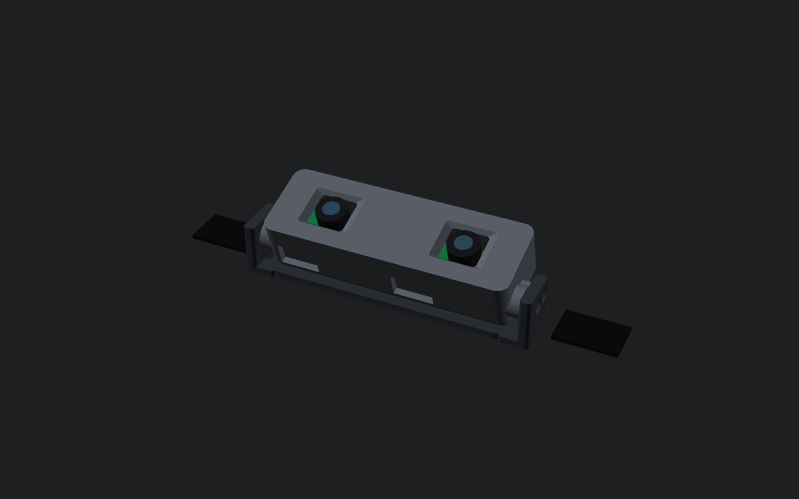
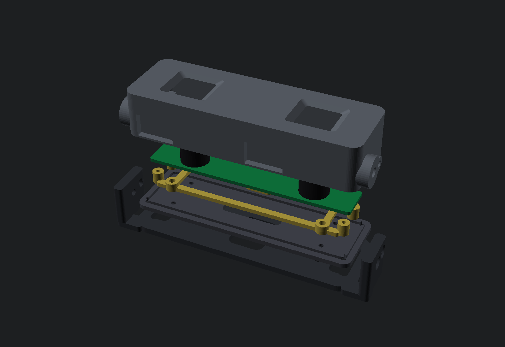
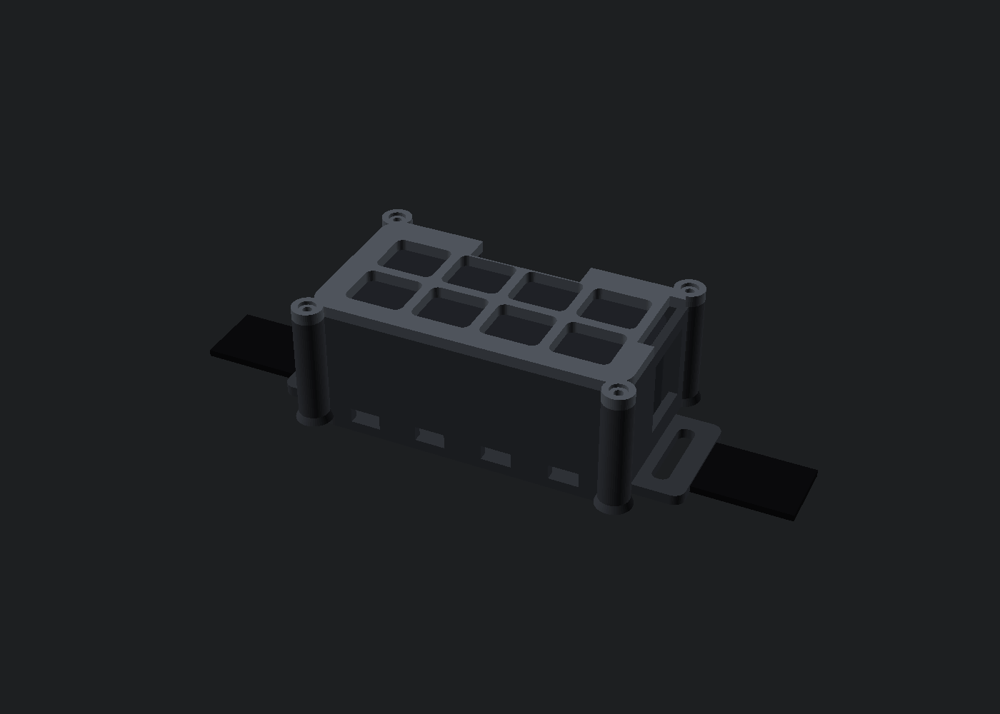
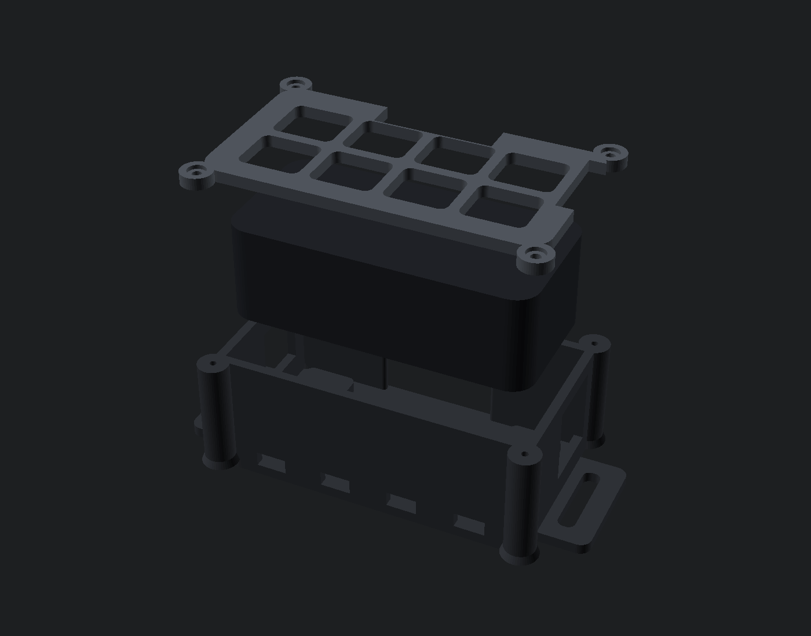

# HAMPOカメラ / RHB02BK 前後マウント v0.2

購入済みのGENTOS `RHB02BK`を左右2本のバンドとして使い、額側にHAMPOの
ステレオカメラ基板、後頭部にAnker `A1653`を載せる3Dプリントモデルです。
バンドと支持板を帽子の内側へ入れ、カメラケースはキャップの前縁またはつばの下へ
出します。ベレー帽と衛生帽では、レンズ前だけを布で塞がない位置へ出します。

## リンク先の基板を特定した結果

HAMPOの
[Stereo Global Shutter Ego Camera製品ページ](https://www.hampotech.com/stereo-global-shutter-ego-camera-product/)
に掲載されている細長い裸基板は、同ページの仕様表では **Model 3290**、機械図では
**図番2.03.3290.011**です。USB-3372-V1.0とは別の基板です。

| 3290の項目 | CADへ入れた値 | 根拠 |
|---|---:|---|
| 基板外形 | 100 × 17 mm | 公開機械図 |
| 基板厚 | 1.6 mm | 公開機械図 |
| 基板下面から最高部 | 16.8 mm | 公開機械図 |
| レンズ中心間隔 | 60 mm | 公開機械図 |
| レンズ鏡筒外径 | 14 mm | 公開機械図 |
| レンズ高さ | 15.15 ± 0.3 mm | 公開機械図 |
| 外側4穴の中心間隔 | 94 × 13 mm | 公開機械図 |
| 外側4穴径 | Ø2.0 mm | 機械図の`4-Ø2`表記を高確度で判読。現物確認対象 |
| 補助2穴径 | Ø1.5 mm | 機械図の`2-Ø1.5`表記。筐体固定には使わない |
| 画角 | D 125° / H 115° / V 80° | 公式仕様表 |
| 最大出力 | 3840 × 1080、30 fps | 公式仕様表 |
| 公称ケーブル長 | 0.5 m / 1 m | 公開データシート |
| 基板側表記 | PH1.25 2PIN / 5PIN | 機械図から判読。メーカーとシリーズは未記載 |

機械図は1200 pxのJPEGだけが公開され、PDF、DXF、STEPは見つかりませんでした。外側4穴の
表記は`4-Ø2`と読め、基板写真の比率とも整合しますが、製造用の確定値は現物で確認します。
CADでは基板穴径`board_mount_hole_diameter=2.0`と、M1.6ねじが通る印刷穴
`board_fastener_clearance=1.9`を分離しました。低材料の`board_gauge_3290.stl`を先に
基板へ重ねます。基板外形、4穴の中心ピッチ、レンズ基線には公開値を使い、基板中心に対する
対称配置は機械図で確認しています。

コネクタはピッチだけでは嵌合ハウジングを特定できないため、HAMPOへ3290サンプルを頼む際は
**2-pinと5-pinの嵌合済みケーブル一式を同梱**するよう指定します。JST-GHやPicoBladeを
外観だけで先に買いません。ケース下側の2開口はコネクタ座標の写真誤差を吸収できる幅にして
あります。

USB-3372は、HAMPOの
[別の公式発表](https://www.hampotech.com/news/hampo-launches-wifi-and-bluetooth-enabled-ego-camera-module-for-untethered-embodied-ai-data-collection/)
に載る、microSD、無線、アンテナ等を持つ背の高い基板です。同社は機械図を公開せず、
データシートは営業窓口への問い合わせ対象と明記しています。このため`3372_fit`は写真
から置いた測定用包絡であり、実機またはメーカー図面を得るまでは発注用形状にしません。

## 完成イメージ









前部の黒い板が額パッドとバンドを受けるヨーク、灰色がカメラケース、黄色が基板を
4点で支える独立キャリアです。カメラは水平から下向き25度まで回転し、左右のM2
ストップねじが両端で止めます。通常位置は下向き17度です。

後部は密閉ポケットではなく開放ケージです。電池と頭側板の間に3 mmの空気層を作り、
外側リテーナーの8開口と下側4開口で空気を逃がします。外側の細い格子は、伸縮する帽子
の布がA1653まで垂れ込む距離を約16 mm以下に抑えます。

## 印刷ファイル

3290用の前部は次の5点です。

| STL | 個数 | 役割 |
|---|---:|---|
| [`front_yoke_3290.stl`](stl/front_yoke_3290.stl) | 1 | 額パッド、RHB02BK、角度軸の支持体 |
| [`front_case_3290.stl`](stl/front_case_3290.stl) | 1 | 3290外殻。画角から広げた2個のレンズ窓付き |
| [`front_cover_3290.stl`](stl/front_cover_3290.stl) | 1 | 頭側の着脱蓋。ケースとキャリアを別ねじで保持 |
| [`board_carrier_3290.stl`](stl/board_carrier_3290.stl) | 1 | 基板4穴を同じ高さで支える剛性フレーム |
| [`board_gauge_3290.stl`](stl/board_gauge_3290.stl) | 1 | 基板外形、4穴、鏡筒径と基線長の先行確認用 |

USB-3372用には同じ5ファイルを`*_3372_fit.stl`として出力します。これらはメーカー
寸法ではなく、実機を置いて差分を測るための初稿です。特にアンテナ、microSD、USB、
ボタン、ブザー配線、取付穴の位置は未確定です。

後部と治具は両プロファイルで共通です。

| STL | 個数 | 役割 |
|---|---:|---|
| [`rear_cradle.stl`](stl/rear_cradle.stl) | 1 | A1653、後頭部パッド、RHB02BKを受ける開放ケージ |
| [`rear_retainer.stl`](stl/rear_retainer.stl) | 1 | 帽子布を電池から離して保持する外側格子 |
| [`pivot_washer.stl`](stl/pivot_washer.stl) | 2 | M3角度軸用、外径10 / 内径3.6 / 厚さ0.6 mmのTPU摩擦ワッシャー |
| [`band_coupon.stl`](stl/band_coupon.stl) | 1 | 3.5 / 4.0 / 4.5 mmのバンド穴を比較 |
| [`band_pull_coupon.stl`](stl/band_pull_coupon.stl) | 1 | 実部品と同じ外側肉厚でバンド引張を確認 |
| [`insert_coupon.stl`](stl/insert_coupon.stl) | 1 | 縦穴用インサート下穴の比較 |
| [`insert_coupon_horizontal.stl`](stl/insert_coupon_horizontal.stl) | 1 | 横穴用インサート下穴の比較 |
| [`rear_screw_coupon.stl`](stl/rear_screw_coupon.stl) | 1 | 後部Bタイトねじ用1.6 / 1.7 / 1.8 mm下穴の比較 |
| [`cable_clip.stl`](stl/cable_clip.stl) | 3 | 右バンドへ直径約4.2 mmのケーブルを並走させるTPUクリップ |

## 外形と印刷物の重さ

STLを全密度PETGとして積算した上限値です。通常のスライサー設定では内部が充填材へ
置き換わるため、これより軽くなります。基板、電池、ねじ、パッドは含みません。最新値は
[`STL-CHECK.txt`](STL-CHECK.txt)にあります。

| 部位 | 最大外形 | PETG全密度の上限 |
|---|---:|---:|
| 3290前ケース | 118.4 × 36.0 × 22.0 mm | 約32 g |
| 3290前蓋 | 108.0 × 34.0 × 3.6 mm | 約10 g |
| 3290キャリア | 約100 × 24 × 6 mm | 約3 g |
| 3290ヨーク | 約130 × 39 × 23 mm | 約18 g |
| 後部ケージ | 約110 × 57 × 33 mm | 約40 g |
| 後部リテーナー | 約89 × 55 × 3 mm | 約7 g |

A1653の公式値は約77 × 37 × 25 mm、約102 gです。前部を額上部、後部を後頭骨の
張り出しへ置き、バンドがほぼ水平になる高さを初期位置にします。後部が下へ引く場合は、
前部を5〜10 mm下げ、左右バンドを一段弱めると帽子との干渉を増やさず調整できます。

## 国内1店にまとめた固定部品

2026年9月11日時点で、次を[ウィルコ](https://wilco.jp/guide/)の1注文へまとめられます。
同社は個人・ゲスト購入に対応し、税別2,000円以上は送料無料です。予備とクーポン分を
含む合計は税別6,420円、税込7,062円です。

| 用途 | ウィルコ品番 | 注文数 | 税別小計 |
|---|---|---:|---:|
| M2熱圧入インサート | [HSB-203030](https://wilco.jp/products/B/HSB.html) | 20 | 1,260円 |
| M3熱圧入インサート | [HSB-304540](https://wilco.jp/products/B/HSB.html) | 10 | 670円 |
| 前蓋からケース用M2 × 5皿 | [UF-0205](https://wilco.jp/products/U/UF.html) | 10 | 330円 |
| 前蓋からキャリア用M2 × 6皿 | [UF-0206](https://wilco.jp/products/U/UF.html) | 10 | 330円 |
| 角度止め用SUS M2 × 8低頭 | [ULH-0208](https://wilco.jp/products/U/ULH.html) | 10 | 330円 |
| 後部用2 × 8 Bタイト | [FXB-0280EB](https://wilco.jp/products/F/FXB-EB.html) | 10 | 330円 |
| ピボット用SUS M3 × 8低頭 | [ULA-0308](https://wilco.jp/products/U/ULA.html) | 10 | 470円 |
| 3290用M1.6 × 8ナイロック | [U-1680NL-01](https://wilco.jp/products/U/U-NL-1.html) | 10 | 900円 |
| M1.6ナット | [UNTD-016](https://wilco.jp/products/U/UNTD.html) | 10 | 1,500円 |
| M1.6用PA6ワッシャ、内径1.7 / 外径4 / t0.3 | [NN-1704-03](https://wilco.jp/products/PA/NN.html) | 10 | 300円 |

`ULH-0208`はT4、`ULA-0308`と`UF-0205` / `UF-0206`は#1、M1.6ねじは#0です。
`FXB-0280EB`はピッチ0.635の樹脂用Bタイトで、M2 × 0.4の真鍮インサートへ入れては
いけません。後部のPETGへだけ使います。

HSB-203030はD1 3.0 mm / D2 3.3 mm / L 3.0 mm、HSB-304540は
D1 4.5 mm / D2 4.8 mm / L 4.0 mmです。メーカー基準は下穴実寸がD1 + 0.05 mm、
深さがL + 0.5 mm以上です。CADの初期値をM2 3.05 × 深さ3.5 mm、M3 4.55 ×
深さ4.5 mmとし、印刷方向別クーポンに前後の候補径も入れています。細いD1側から樹脂へ
圧入します。

M1.6 × 8の基板ねじは、キャリア裏の頭部座面を1.7 mm奥へ入れることで、PCB 1.6 mm、
PA6ワッシャー0.3 mm、UNTDナット1.3 mmを含む公称スタックより0.7 mm先へ出ます。
CADはこの条件をassertで検査します。M2 × 5ではキャリア側インサートへの掛かりが
1.5 mmしか残らないため、キャリア4本だけM2 × 6へ分けています。
M1.6ねじ頭は外面から1.2 mm奥なので、この4本には軸径3.0 mm以下の#0ドライバーを使います。
キャリアのアクセス穴は直径3.4 mmです。手元の#0が太い場合は、同店の
[ANEX TDA-0-100M](https://wilco.jp/products/tool/TDA-M.html)（軸径3 mm、税別590円）を
1本追加します。この工具代は上の固定部品合計に含めていません。

ウィルコ外の消耗材は、TPU 95Aを約5 g、幅2.5 mm × 長さ100 mmの結束バンドを6本、
軟質ウレタンフォームを用意します。肌側は厚さ5 mm、電池側面は厚さ1.5 mm、電池外側面は
厚さ3 mmです。フォームにはPORON 4701-30相当の軟らかさを使います。

## 最初に印刷するもの

1. `band_coupon.stl`を印刷し、RHB02BKの自由端と折返しが通る最小の穴厚を選びます。
   GENTOSがバンド幅と厚さを公表していないため、CADの19 mmは販売店参考値です。
2. 選んだ穴で`band_pull_coupon.stl`を印刷します。バンドを実際と同じ折返し方で通し、
   片側50 Nを30秒、3回かけ、白化、亀裂、抜けがないことを確認します。
3. 購入したインサートと同じ材料・温度・プリンターで`insert_coupon.stl`と
   `insert_coupon_horizontal.stl`を印刷します。上段がM3、下段がM2、1・2・3個の
   突起が小・中・大の下穴です。回転せず、周囲が膨らまない径を選びます。
4. `rear_screw_coupon.stl`へBタイトを一度ずつ締め、割れずに3回再締結できる穴を選びます。
5. 3290なら`board_gauge_3290.stl`を基板へ重ね、外形、4穴、2個の鏡筒が無理なく合う
   ことを確認します。USB-3372なら`board_gauge_3372_fit.stl`へ実機を置いて差を測り、
   SCADのプロファイル値を更新します。
6. クーポンを通過してから、未印刷の前部4点、後部2点、`pivot_washer`を2枚、
   `cable_clip`を3個印刷します。

## 印刷条件

- 初号機: PETGまたはASA。ケースと支持体にPLAは使わない
- 0.4 mmノズル、0.20 mmレイヤー
- 外周5本、上下5層、25〜30% gyroid
- バンド耳、ねじ柱、角度軸の周囲はスライサーのモディファイアで100%充填
- `front_case_*`はレンズ面を造形プレート側にした向きで出力済み。角度軸だけ局所支持
- `front_yoke_*`、`front_cover_*`、`board_carrier_*`、`rear_cradle`は頭側の平面を下にする
- `rear_retainer`はねじ頭の座ぐりが上を向くよう出力済み
- `pivot_washer`はTPU 95A、0.20 mmレイヤー3層で2枚印刷する
- `cable_clip`はTPU 95Aで印刷し、16 × 7 mmの接地面へ5 mm以上のブリムを付ける

## 前部の組立

1. ケースのM3軸穴2か所へM3インサート、M2ストップ穴2か所と蓋穴4か所へM2
   インサートを熱圧入します。キャリアの4個のボスにも上側からM2インサートを入れます。
2. M1.6 × 8ねじをキャリア裏から通し、各支点へ3290基板、PA6ワッシャ、ナットの順で
   載せます。ワッシャはPCB上面のナット直下だけです。4本を対角順に、基板が反らない
   ところまで均等に締めます。
3. HAMPO同梱の2-pin / 5-pinハーネスを基板へ接続します。各コネクタから15〜20 mm離れた
   ハーネスをキャリアの下側横レールへ2.5 mm結束バンドで1本ずつ固定し、コネクタへ張力が
   掛からないことを確認します。
4. キャリアを前蓋へM2 × 6皿ねじ4本で固定します。ハーネスをケース下側の開口へ通しながら
   キャリアと蓋をケースへ差し込み、別のM2 × 5皿ねじ4本でケースへ固定します。ハーネスを
   蓋、ケース、基板の間に挟まないよう目視します。
5. ヨークとケースの左右へ`pivot_washer.stl`を1枚ずつ入れ、M3 × 8低頭ねじを仮締めします。
6. M2 × 8低頭ねじをヨークの弧状穴からケース側インサートへ入れます。角度を決め、M3
   ねじをカメラが自重で下がらず、手では動かせる強さへ左右交互に締めます。
7. ケース出口から固定側ヨークまで35〜45 mmのU字状の可動余長を残し、ヨークの3 mm穴へ
   結束バンド1本で固定します。ケースを0〜25度動かし、内部のコネクタとハーネスが引かれない
   ことを確認します。
8. 右側RHB02BKを元のバックルへ折り返す前に、`cable_clip.stl`を3個通します。その後に
   左右バンドをヨークの縦穴へ通してバックルへ戻し、ケーブルを右バンドへ沿わせます。
   実際のハーネス束外径が4.2 mmと違う場合は、SCADの`cable_diameter`を実測値へ変えて
   再出力します。

基板キャリアを前蓋から分離したのは、蓋を締めた力でステレオ基板を曲げないためです。
レンズ窓は鏡筒径だけの直穴ではなく、公開された水平・垂直画角に4度の余裕を加えて
外側へ広げてあり、1.9 mmの前壁が視野へ入りません。

## 後部の組立

追加材料は、額側30 × 22 × 5 mmのEVAまたはPoronを2枚、後頭部側24 × 18 ×
5 mmを2枚、A1653外側面用の厚さ3 mmフォーム小片を4枚、上下左右用の厚さ1.5 mm
フォーム細片を4枚です。

1. A1653はロゴ/LED面を外側、折畳USB-Cを上、USB-Cポートを装着者の右、ボタンを左に
   向けます。右端ポート、左端ボタン、上辺の折畳端子が各開口へ入ることを先に確認します。
2. 1.5 mmフォーム4本をケージの上下左右レール内面へ貼り、3 mmフォーム4片を外側格子の
   電池側4隅へ貼ります。装着状態で側面フォームが1.0 mm以下、外側面フォームが2.0 mm以下
   まで無理なく圧縮することを切れ端で先に確認します。硬いEVAはこの隙間へ使いません。
   電池へ両面テープを直貼りしません。
3. A1653をケージへ入れ、外側格子をBタイト2 × 8ねじ4本で対角順に固定します。電池が
   振っても動かず、ボタンと折畳端子が押されていないことを確認します。
4. 右側開口からUSB-CケーブルをA1653へ接続し、コネクタから固定点まで25〜35 mmの緩い
   曲線を残します。外被を後部ケージ右側の3 mm穴2個へ2.5 mm結束バンド1本で固定し、
   ケーブルを引いても端子へ荷重が伝わらないことを確認します。
5. RHB02BKを左右の縦穴へ通します。帽子の後部開口が使える場合は、ケージの格子面だけを
   開口から外へ出すと通風とケーブル操作が楽になります。

A1653の公式外形は約77 × 37 × 25 mmですが、端子中心、ボタン中心、コーナーRの寸法図は
公開されていません。CADは公式写真から右ポートと左ボタンを上へ7 mm寄せ、操作開口を
広く取っています。現物に対してずれる場合は、`rear_port_center_y`と
`rear_button_center_y`だけを変えて後部ケージを再生成します。

## 帽子との位置関係

- キャップ: ヨークとバンドは汗止め帯の内側、カメラケースは前縁から外へ出し、つばより
  8〜15 mm上へ置く。後部はサイズ調整穴の上か、格子だけ穴の外へ出す
- ベレー帽: バンド全体と後部を布の内側へ入れ、前部ケースだけ折返し縁の下へ出す
- 衛生帽: 格子のある後部まで覆えるが、右側ケーブル出口と下側4開口を塞がない。カメラ
  前面は帽子の外へ出す

額と後頭部には、板全体を密着させず2枚のフォームで荷重を受けます。CADの2 mm穴が
パッド中心です。最初の装着では30分、2時間、5時間の順に延ばし、額の局所圧迫、後部の
ずれ、レンズ角度、A1653表面温度を記録します。A1653の公式使用温度は0〜35°Cです。

## 再生成と検証

OpenSCADを導入したmacOSでは次で全STLとプレビューを再生成します。

```bash
document/hardware/hampo-rhb02bk-headset/cad/build.sh
```

ビルドは全STLをCGALで完全レンダーし、バイナリSTLの長さ、三角形、外形、体積を
[`STL-CHECK.txt`](STL-CHECK.txt)へ記録します。さらに3290と3372_fitの両方で、
ケース対キャリア、蓋対キャリア、ケース対基板を交差計算します。ヨーク対可動部は
0 / 5 / 10 / 15 / 20 / 25度の全6姿勢で交差計算し、すべて空集合であることを確認します。
後部もリテーナー対ケージ、A1653包絡対ケージを交差計算します。判定対象は印刷部品と
公称寸法の基板・電池包絡で、ねじ、インサート、フォーム、ケーブルは組立手順で確認します。

パラメトリック正本は
[`hampo_rhb02bk_mount.scad`](cad/hampo_rhb02bk_mount.scad)です。

## 参照した一次資料

- [HAMPO 3290製品ページ](https://www.hampotech.com/stereo-global-shutter-ego-camera-product/)
- [HAMPO 3290公開データシート画像](https://www.hampotech.com/uploads/02222.jpg)
- [HAMPO 3290機械図画像](https://www.hampotech.com/uploads/0888.jpg)
- [HAMPO 3290公式基板写真（2736 px）](https://www.hampotech.com/uploads/3290%E6%A8%A1%E7%BB%84-011.jpg)
- [HAMPO USB-3372公式発表](https://www.hampotech.com/news/hampo-launches-wifi-and-bluetooth-enabled-ego-camera-module-for-untethered-embodied-ai-data-collection/)
- [GENTOS RHB02BK公式製品情報](https://www.gentos.jp/products/series/accessory_headlight/rhb02bk/)
- [GENTOS取付動画一覧](https://www.gentos.jp/products-manuals-02/)
- [Anker A1653公式仕様](https://www.ankerjapan.com/products/a1653)
- [Anker A1653取扱説明書](https://lp.ankerjapan.com/hubfs/aoos/manual/A1653Manual.pdf)
- [Anker A1653安全資料](https://lp.ankerjapan.com/hubfs/aoos/manual/A1653Safety.pdf)
